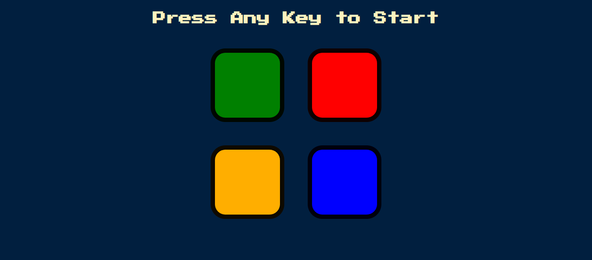

# Simon-Game

## Table of contents

- [Overview](#overview)
  - [Description](#description)
  - [Screenshot](#screenshot)
  - [Links](#links)
- [My Process](#my-process)
  - [Built with](#built-with)
  - [What I Learned](#what-i-learned)
  - [Continued development](#continued-development)
  - [Useful resources](#useful-resources)
- [Author](#author)

## Overview

### Description

This website is a game where the object is to repeat a series of random tile clicks created by the
game. After each round, the sequence becomes progressively longer and more complex which
makes it harder to remember. You’ll have four different tiles, each with a unique color and sound
which is activated when pressed. The purpose of the game is to reproduce the longest series of
colors/sounds randomly generated by Simon, it's an endless game!

### Screenshot

### Links

Live Site URL: https://shubhamkumar3110.github.io/Simon-Game/

## My Process

### Built with

- HTML
- CSS
- JavaScript

### What I Learned

I learned that we can get the characters pressed by the user using the keydown eventlistner.

### Continued development

I will be focusing on building responsive web pages.

### Useful resources

[Dr. Angela Yu](https://www.udemy.com/user/4b4368a3-b5c8-4529-aa65-2056ec31f37e/) - I followed the tutorials provided by Dr. Angela Yu.

## Author
Shubham Kumar
